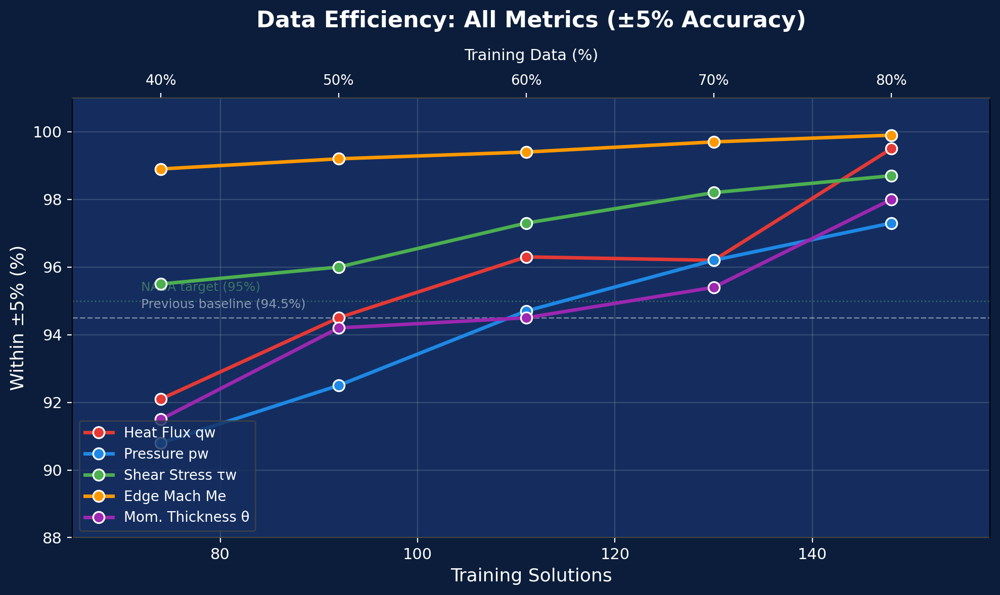
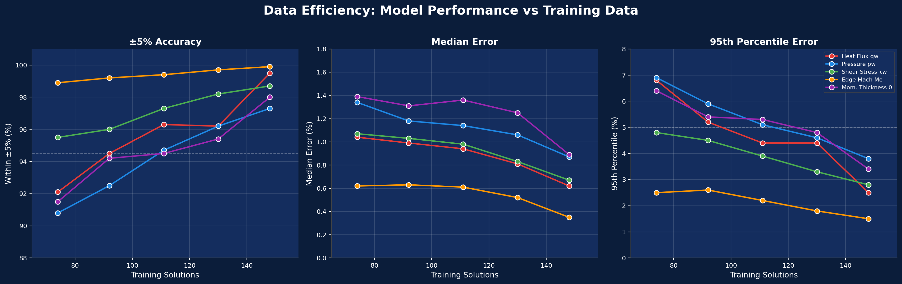
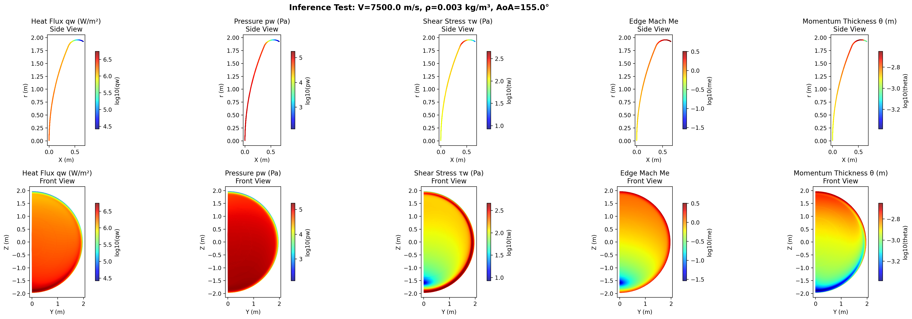
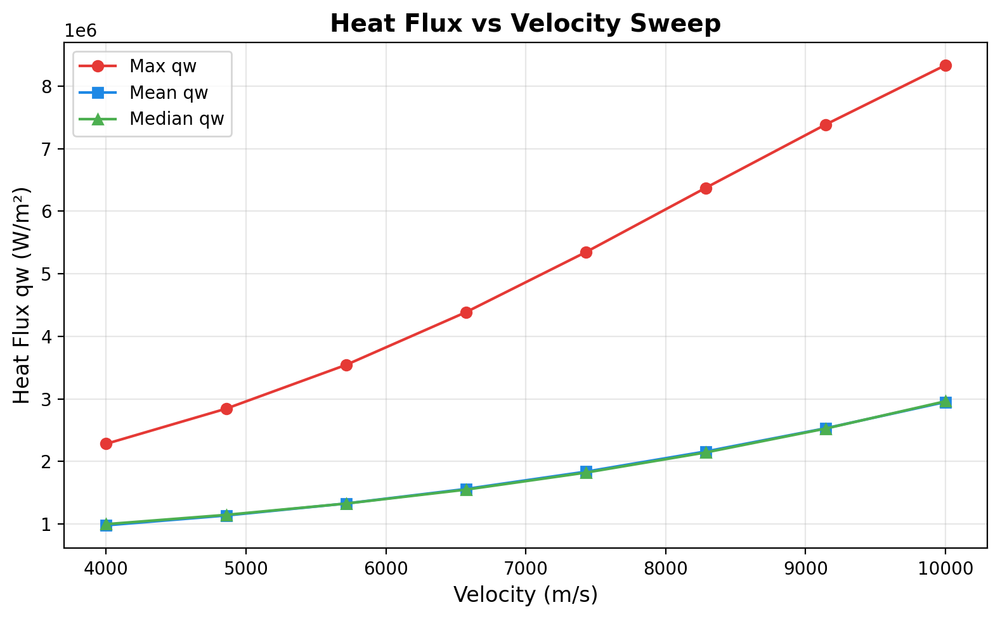
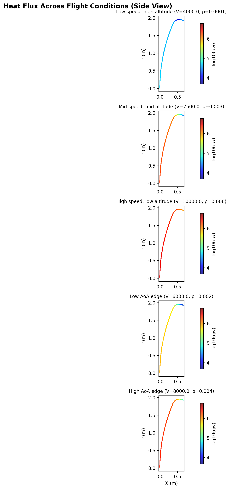

# Mamba-Enhanced Physics-Informed Autoencoder for Apollo Reentry CFD Surrogate Modeling

A deep learning surrogate model that predicts aerothermal surface quantities on the Apollo capsule during atmospheric reentry, replacing expensive CFD simulations with sub-second inference.

## Best Results

Fully converged model (seed 456, 300 epochs, 40h training) evaluated on 19 held-out CFD solutions (~935,000 surface points):

| Output | Within ±1% | Within ±3% | Within ±5% | Within ±10% | Median Error | 95th %ile |
|--------|-----------|-----------|-----------|------------|-------------|----------|
| Heat Flux qw (W/m²) | 70.4% | 96.7% | **99.5%** | 100.0% | 0.62% | 2.5% |
| Pressure pw (Pa) | 55.9% | 92.0% | **97.3%** | 99.4% | 0.87% | 3.8% |
| Shear Stress τw (Pa) | 66.9% | 95.5% | **98.7%** | 99.9% | 0.67% | 2.8% |
| Edge Mach Me (-) | 87.6% | 99.5% | **99.9%** | 100.0% | 0.35% | 1.5% |
| Momentum Thickness θ (m) | 54.6% | 93.0% | **98.0%** | 99.5% | 0.89% | 3.4% |

### Physics Ablation Matrix (qw ±5%)

| Split | No Physics | Normal Physics | Strong Physics (5x) | MLP Baseline |
|-------|-----------|---------------|---------------------|-------------|
| 80/10/10 | **98.5%** | 98.0% | 98.4% | 96.8% |
| 60/20/20 | **96.8%** | 96.3% | 95.8% | — |
| 40/30/30 | **92.9%** | 92.1% | 92.2% | — |

No-physics model outperforms at every data split. Physics constraints add optimization overhead without providing new information when sufficient training data is available. Strong physics (5x lambda) slightly improves over normal physics at 80% data but degrades at lower splits.

### Comparison to Previous Approaches

| Model | qw ±5% | Architecture |
|-------|--------|-------------|
| **This work (best)** | **99.5%** | Mamba-3 SSM, full mesh, overlapping partitions |
| MLP Baseline (same pipeline) | 96.8% | Pointwise MLP, same training pipeline |
| Simple Autoencoder | 94.5% | Pointwise dense layers |
| Mamba (downsampled) | 94.4% | Mamba-3 SSM, 4K subsample |
| Two-Stage NN (no leakage) | 79.6% | Physics-aware two-stage MLP |

## Data Efficiency

How many CFD simulations does NASA need? Accuracy degrades gracefully as training data decreases:



| Split | Train Solutions | qw ±5% | pw ±5% | tw ±5% | Me ±5% | θ ±5% | Test Solutions |
|-------|----------------|--------|--------|--------|--------|-------|---------------|
| 80/10/10 | 148 | 99.5% | 97.3% | 98.7% | 99.9% | 98.0% | 19 |
| 70/15/15 | 130 | 96.2% | 96.2% | 98.2% | 99.7% | 95.4% | 27 |
| 60/20/20 | 111 | 96.3% | 94.7% | 97.3% | 99.4% | 94.5% | 37 |
| 50/25/25 | 92 | 94.5% | 92.5% | 96.0% | 99.2% | 94.2% | 47 |
| 40/30/30 | 74 | 92.1% | 90.8% | 95.5% | 98.9% | 91.5% | 55 |

The model trained on 50% of the data matches the accuracy of the previous pointwise baseline trained on 80%. Even at 40% (74 solutions), all metrics remain above 90%.



### Key Findings

- **Architecture matters**: Mamba SSM (99.5%) outperforms MLP baseline (96.8%) by 2.7% — spatial context from sequential modeling captures patterns that pointwise models miss
- **Physics losses are redundant with sufficient data**: No-physics consistently outperforms physics-informed models at every data split tested (80% through 40%)
- **Training pipeline contributes more than architecture**: MLP baseline (96.8%) beats the previous simple autoencoder (94.5%) using the same pointwise approach — the improvement comes from overlapping partitions, Huber loss, gradient accumulation, and the full training pipeline
- **Graceful degradation**: Reducing training data from 148 to 74 solutions costs only 6.4% qw accuracy

## Inference

The packaged model predicts all 5 surface quantities for any flight condition in ~3.3 seconds on a single GPU. Inference test suite passes **71/71** checks covering loading, physical plausibility, monotonicity, determinism, spatial patterns, and performance.







### Quick Start

```bash
# Package the trained model (one time)
python package_model.py --checkpoint organized_results/full_model_long/best_model.pt \
                        --output packaged_model/ --split_seed 456
```

```python
from inference import MambaSurrogate

# Load once (~3s)
surrogate = MambaSurrogate('packaged_model/')

# Predict for any flight condition (~3s per prediction)
results = surrogate.predict(velocity=7500, density=0.003, aoa=155, dynamic_pressure=84375)

qw = results['qw']      # (49698,) heat flux in W/m^2
pw = results['pw']       # (49698,) pressure in Pa
tw = results['tw']       # (49698,) shear stress in Pa
me = results['me']       # (49698,) edge Mach number
theta = results['theta'] # (49698,) momentum thickness in m
xyz = results['xyz']     # (49698, 3) mesh coordinates for visualization

# Sweep a trajectory
for v in [4000, 6000, 8000, 10000]:
    r = surrogate.predict(velocity=v, density=0.003, aoa=155, dynamic_pressure=0.5*0.003*v**2)
    print(f"V={v}: max qw = {r['qw'].max():.0f} W/m^2")
```

## Architecture

**MambaAutoencoder** (244K parameters):
- Input projection: 7 features → 64-dim embedding
- Encoder: 4× Mamba-3 blocks with selective SSM, RoPE, trapezoidal discretization
- Latent bottleneck: 64 → 16 dims (regularizes via reconstruction loss)
- 5 prediction heads: branch from encoder output (64-dim), one per surface quantity
- Reconstruction head: from latent (16-dim), reconstructs input features

Key design choices:
- **Spatial sorting**: Mesh points ordered by geodesic spiral on capsule surface, converting 3D surface data into a meaningful 1D sequence
- **Overlapping partitions**: 50K-point solutions split into 8 windows (seq_len=8192, stride=6400, overlap=1792) — preserves full mesh resolution
- **Parallel scan**: O(L log L) computation via doubling trick, enabling 8K sequences on GPU
- **Mamba-3 extensions**: Data-dependent RoPE for non-uniform spatial encoding, trapezoidal discretization for sharp gradient capture

## Data Pipeline

1. **Input**: 185 Apollo reentry CFD solutions × 50,176 surface points × 7 features
2. **Cleaning**: Remove separated flow regions (theta < 0) — ~2% of points
3. **Spatial sort**: Geodesic spiral from stagnation point outward (64 latitude bands)
4. **Partitioning**: Overlapping sliding windows with padding for last partition
5. **Scaling**: log10 transform + StandardScaler on targets; StandardScaler on inputs
6. **Split**: By solution (no data leakage — scalers fitted on training data only)

## Training

- **Optimizer**: AdamW (lr=1e-3, weight_decay=8e-3)
- **Loss**: Weighted Huber (smooth L1) on standardized log10 targets + reconstruction loss + optional physics constraints
- **Gradient accumulation**: 4 steps (effective batch size 16 across 4 GPUs)
- **LR schedule**: 5-epoch linear warmup → ReduceLROnPlateau (factor=0.5, patience=10)
- **Early stopping**: patience=25 on validation loss
- **Hardware**: 4× NVIDIA L40S (48GB each) on Rice NOTS cluster via DDP
- **Training time**: 20-40 hours depending on configuration
- **GPU memory**: ~12.6 GB / 46 GB per GPU (27% utilization)

## Experiments

| Experiment | Description |
|-----------|-------------|
| `slurm_train.sh` | Full model — 5 outputs, physics losses, Mamba-3 |
| `slurm_no_physics.sh` | Ablation — same model, no physics loss terms |
| `slurm_qw_only.sh` | Ablation — single output (heat flux only) |
| `slurm_mlp.sh` | MLP baseline — pointwise blocks, no sequential modeling |
| `slurm_70_15.sh` | Data efficiency — 70/15/15 train/val/test split |
| `slurm_60_20.sh` | Data efficiency — 60/20/20 train/val/test split |
| `slurm_50_25.sh` | Data efficiency — 50/25/25 train/val/test split |
| `slurm_40_30.sh` | Data efficiency — 40/30/30 train/val/test split |
| `slurm_no_physics_60.sh` | No physics at 60/20/20 |
| `slurm_no_physics_40.sh` | No physics at 40/30/30 |
| `slurm_strong_physics_80.sh` | Strong physics (5x lambdas) at 80/10/10 |
| `slurm_strong_physics_60.sh` | Strong physics (5x lambdas) at 60/20/20 |
| `slurm_strong_physics_40.sh` | Strong physics (5x lambdas) at 40/30/30 |
| `slurm_seed2_full.sh` | Cross-validation fold 2 — full model, seed 456 |
| `slurm_strong_physics_80_seed2.sh` | Strong physics fold 2 — seed 456, long partition |
| `slurm_error_maps.sh` | Generate spatial error heatmaps for all models |
| `slurm_package_and_test.sh` | Package best model and run inference tests |

## Project Structure

```
├── config.py                  # Model and training configuration
├── model.py                   # MambaAutoencoder architecture
├── dataset.py                 # Data loading, spatial sorting, partitioning
├── train.py                   # DDP training loop
├── evaluate.py                # Overlap-averaged evaluation and plotting
├── eval_checkpoint.py         # Standalone checkpoint evaluation
├── physics_losses.py          # Physics-informed loss constraints
├── create_error_maps.py       # Spatial error heatmap generation
├── package_model.py           # Package model for production deployment
├── inference.py               # Production inference wrapper (MambaSurrogate class)
├── TECHNICAL_REFERENCE.md     # Comprehensive technical documentation
├── INFERENCE_GUIDE.md         # Inference API and deployment guide
├── slurm_*.sh                 # SLURM job scripts for NOTS cluster
├── data/                      # Apollo CFD database (CSV)
├── packaged_model/            # Production-ready model (weights, scalers, mesh, config)
├── test_inference/            # Inference test suite (71/71 passing)
├── organized_results/         # Training logs, checkpoints, error maps, evaluation plots
│   ├── full_model/            # 80/10/10, physics, seed 123
│   ├── no_physics/            # 80/10/10, no physics, seed 123
│   ├── qw_only/               # 80/10/10, qw only, seed 123
│   ├── full_model_long/       # 80/10/10, physics, seed 456 (fully converged, best)
│   ├── mlp_baseline/          # 80/10/10, MLP blocks (no sequential modeling)
│   ├── no_physics_60/         # 60/20/20, no physics
│   ├── no_physics_40/         # 40/30/30, no physics
│   ├── strong_physics_80/     # 80/10/10, strong physics (5x lambdas)
│   ├── strong_physics_60/     # 60/20/20, strong physics (5x lambdas)
│   ├── strong_physics_40/     # 40/30/30, strong physics (5x lambdas)
│   ├── full_70_15/            # 70/15/15 split
│   ├── full_60_20/            # 60/20/20 split
│   ├── full_50_25/            # 50/25/25 split
│   └── full_40_30/            # 40/30/30 split
└── partition_graph/           # Data efficiency plots (accuracy vs training data)
```

## Limitations

- **Separated flow excluded**: ~2% of surface points (theta < 0) in wake/recirculation region
- **Interpolation only**: Trained on Mach 10-35, AoA 152-158° — no extrapolation guarantees
- **Fixed geometry**: Apollo capsule only — different vehicles require retraining (architecture is geometry-agnostic but untested on other shapes)
- **No uncertainty quantification**: Point predictions without confidence intervals
- **Cross-validation**: 2-fold (seeds 123 and 456) — sufficient for semester scope, additional folds planned
